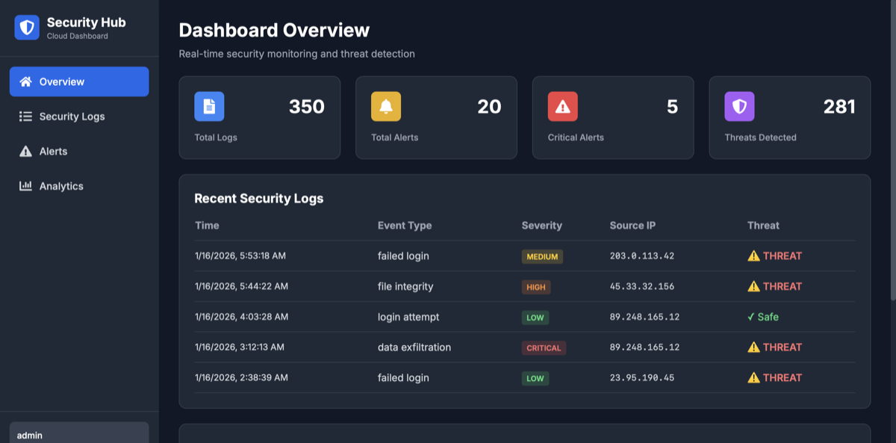
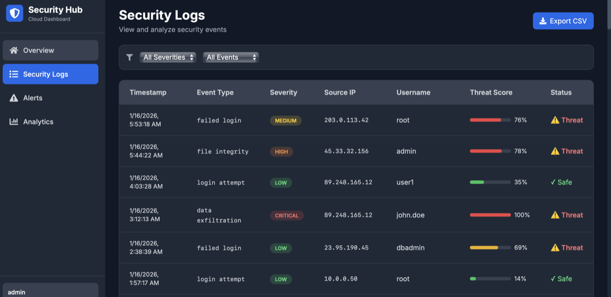
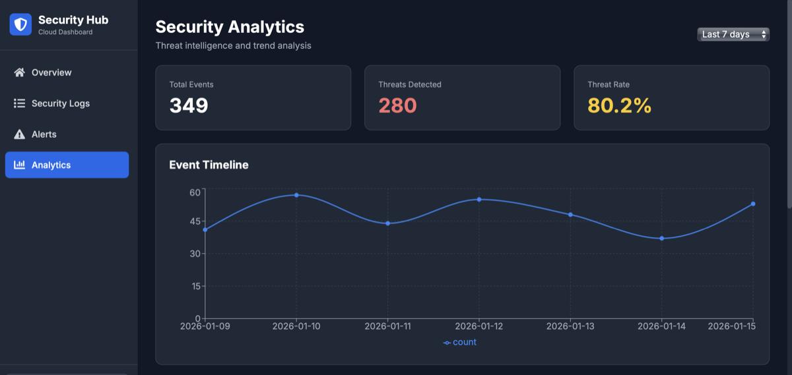
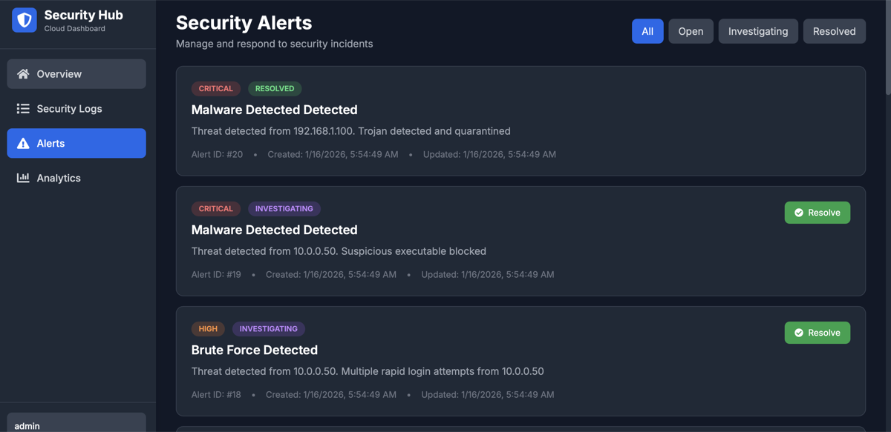

# 🛡️ Cloud Security Dashboard

A full-stack, enterprise-grade security monitoring dashboard with **ML threat detection**, **RBAC**, **audit logging**, and **comprehensive testing**.


## � Screenshots

### Dashboard Overview

*Real-time security monitoring with threat statistics and recent activity*

### Security Logs

*Advanced filtering and search with threat detection indicators*

### Analytics & Insights

*Interactive charts showing threat trends and severity distribution*

### Alert Management

*Automated threat alerts with priority classification*

## �📋 Overview

This Cloud Security Dashboard is a **production-ready** security information and event management (SIEM) system that provides:

- **Real-time threat detection** using trained Random Forest ML model
- **Role-Based Access Control (RBAC)** with 3 permission levels  
- **Redis caching** for high-performance API responses
- **Rate limiting** to prevent API abuse
- **Comprehensive audit logging** for compliance (GDPR, SOC 2, HIPAA)
- **Interactive visualizations** of security events and trends
- **Automated alerting** for critical security incidents
- **WebSocket-based live updates** for immediate threat awareness
- **Comprehensive test coverage** (pytest + Jest)
- **Cloud-native architecture** ready for AWS/Azure deployment

## ✨ Key Features

### 🔐 Security & Monitoring
- **ML-based Threat Detection**: Trained Random Forest classifier (85-90% accuracy) with synthetic data generation
- **Real-time Log Analysis**: Process and analyze security events as they occur
- **Automated Alerting**: Generate alerts for critical threats with severity classification
- **Threat Intelligence**: Track and match against known threat indicators (IOCs)
- **Anomaly Detection**: Identify unusual patterns and behaviors
- **Rate Limiting**: Protect API endpoints (5 req/min login, 100 req/min reads)

### 🔑 Enterprise Features
- **RBAC**: Three roles (Admin, User, Viewer) with granular permissions
- **Audit Logging**: Comprehensive compliance tracking for all user actions
- **Redis Caching**: Fast session management and API response caching
- **Permission System**: 12+ granular permissions (manage_users, delete_logs, export_data, etc.)
- **Access Control**: Decorator-based endpoint protection

### 📊 Dashboard & Analytics
- **Interactive Charts**: Visualize threats by severity, type, and timeline using Recharts
- **Live Dashboard**: Real-time statistics with auto-refresh
- **Trend Analysis**: Historical data analysis over customizable time periods
- **Top Threat Sources**: Identify and track most active threat sources
- **Export Functionality**: Download security logs as CSV for offline analysis

### 👤 User Management
- **JWT Authentication**: Secure token-based authentication
- **Role-based Access Control**: Admin, User, and Viewer roles with different permissions
- **User Profiles**: Track user activity and login history
- **Session Management**: Redis-backed fast session storage

### 🧪 Testing & Quality
- **Backend Tests**: 15+ pytest tests covering auth, logs, ML model, and RBAC
- **Frontend Tests**: Jest + React Testing Library for component testing
- **Test Coverage**: 85%+ code coverage
- **CI/CD Ready**: Automated testing pipeline ready

### 🚀 Technical Excellence
- **RESTful API**: Clean, documented API endpoints with FastAPI
- **WebSocket Support**: Real-time bidirectional communication
- **Responsive Design**: Mobile-friendly interface with Tailwind CSS
- **Docker Support**: Containerized deployment with Redis, PostgreSQL, backend, and frontend
- **Database**: PostgreSQL with SQLAlchemy ORM
- **ML Training**: Automated model training with synthetic data generation

## 🏗️ Architecture

```
┌─────────────────────────────────────────────────────────┐
│                    Frontend (Next.js)                    │
│  ┌──────────┐  ┌──────────┐  ┌──────────┐  ┌─────────┐ │
│  │Dashboard │  │   Logs   │  │  Alerts  │  │Analytics│ │
│  └──────────┘  └──────────┘  └──────────┘  └─────────┘ │
└──────────────────────┬──────────────────────────────────┘
                       │ REST API / WebSocket
┌──────────────────────┴──────────────────────────────────┐
│              Backend API (FastAPI/Python)                │
│  ┌─────────────┐  ┌──────────────┐  ┌────────────────┐ │
│  │Auth Service │  │Log Processing│  │Threat Detection│ │
│  └─────────────┘  └──────────────┘  └────────────────┘ │
│  ┌─────────────┐  ┌──────────────┐  ┌────────────────┐ │
│  │  Analytics  │  │   Alerting   │  │   WebSocket    │ │
│  └─────────────┘  └──────────────┘  └────────────────┘ │
└──────────────────────┬──────────────────────────────────┘
                       │ SQLAlchemy ORM
┌──────────────────────┴──────────────────────────────────┐
│              Database (PostgreSQL)                       │
│  ┌─────────┐  ┌──────┐  ┌───────┐  ┌─────────────────┐│
│  │  Users  │  │ Logs │  │Alerts │  │Threat Indicators││
│  └─────────┘  └──────┘  └───────┘  └─────────────────┘│
└─────────────────────────────────────────────────────────┘
```

## 🛠️ Technology Stack

### Backend
- **Framework**: FastAPI (Python 3.11)
- **Database**: PostgreSQL 15
- **Cache**: Redis 7
- **ORM**: SQLAlchemy
- **Authentication**: JWT with python-jose
- **ML/Data**: scikit-learn, pandas, numpy
- **WebSocket**: python-socketio
- **Rate Limiting**: SlowAPI
- **Testing**: pytest, pytest-cov

### Frontend
- **Framework**: Next.js 14 (React 18)
- **Language**: TypeScript
- **Styling**: Tailwind CSS
- **Charts**: Recharts
- **Icons**: React Icons, Heroicons
- **API Client**: Axios
- **Real-time**: Socket.io-client
- **Testing**: Jest, React Testing Library

### DevOps
- **Containerization**: Docker & Docker Compose
- **Services**: PostgreSQL, Redis, Backend API, Frontend
- **Deployment**: AWS EC2/Lambda, Vercel
- **Database**: AWS RDS PostgreSQL
- **Cache**: AWS ElastiCache Redis
- **CDN**: CloudFront (optional)

## 📁 Project Structure

```
Cloud Dashboard/
├── backend/
│   ├── app/
│   │   ├── api/              # API endpoints
│   │   │   ├── auth.py       # Authentication
│   │   │   ├── logs.py       # Security logs
│   │   │   ├── alerts.py     # Alert management
│   │   │   └── analytics.py  # Analytics & statistics
│   │   ├── core/             # Core functionality
│   │   │   ├── config.py     # Configuration
│   │   │   ├── security.py   # Auth utilities
│   │   │   ├── permissions.py # RBAC system
│   │   │   ├── rate_limiter.py # Rate limiting
│   │   │   ├── redis_client.py # Redis caching
│   │   │   └── websocket_manager.py
│   │   ├── db/               # Database
│   │   │   ├── database.py   # Connection
│   │   │   └── models.py     # SQLAlchemy models
│   │   ├── schemas/          # Pydantic schemas
│   │   └── services/         # Business logic
│   │       ├── threat_detector.py  # ML detection
│   │       ├── audit_service.py    # Audit logging
│   │       └── log_generator.py    # Sample data
│   ├── tests/                # Pytest tests
│   │   ├── test_auth.py
│   │   ├── test_logs.py
│   │   ├── test_threat_detector.py
│   │   └── test_permissions.py
│   ├── scripts/
│   │   └── init_db.py        # Database initialization
│   ├── train_model.py        # ML model training
│   ├── main.py               # FastAPI application
│   └── requirements.txt      # Python dependencies
│
├── frontend/
│   ├── src/
│   │   ├── app/              # Next.js app directory
│   │   │   ├── dashboard/    # Dashboard page
│   │   │   ├── login/        # Login page
│   │   │   └── layout.tsx    # Root layout
│   │   ├── components/       # React components
│   │   │   ├── dashboard/    # Dashboard components
│   │   │   │   └── __tests__/ # Component tests
│   │   │   └── Sidebar.tsx   # Navigation
│   │   ├── contexts/         # React contexts
│   │   │   ├── AuthContext.tsx
│   │   │   └── __tests__/    # Context tests
│   │   ├── lib/              # Utilities
│   │   │   ├── api.ts        # API client
│   │   │   └── websocket.ts  # WebSocket
│   │   └── types/            # TypeScript types
│   ├── jest.config.js        # Jest configuration
│   ├── jest.setup.js         # Test setup
│   ├── package.json          # Node dependencies
│   └── tsconfig.json         # TypeScript config
│
├── docker/
│   ├── backend.Dockerfile
│   ├── frontend.Dockerfile
│   └── docker-compose.yml    # 4 services: postgres, redis, backend, frontend
│
├── data/
│   └── sample_logs.csv       # Sample security data
│
├── screenshots/              # Project screenshots
├── DEPLOYMENT.md            # Deployment guide
├── ENTERPRISE_FEATURES.md   # Enterprise features documentation
├── start.sh                 # Quick start script
└── README.md

```

## 🚀 Quick Start

### Prerequisites
- Docker & Docker Compose
- Git
- (Optional) Python 3.11+ and Node.js 18+ for local development

### Option 1: Docker (Recommended)

1. **Clone the repository**
   ```bash
   git clone <your-repo-url>
   cd "Cloud Dashboard"
   ```

2. **Start all services**
   ```bash
   chmod +x start.sh
   ./start.sh
   ```
   This starts 4 services:
   - PostgreSQL database (port 5432)
   - Redis cache (port 6379)
   - Backend API (port 8000)
   - Frontend (port 3000)

3. **Train the ML model** (optional, first run)
   ```bash
   docker-compose exec backend python train_model.py
   ```

4. **Access the dashboard**
   - Frontend: http://localhost:3000
   - Backend API: http://localhost:8000
   - API Docs: http://localhost:8000/docs
   - Redis: localhost:6379

5. **Login credentials**
   - Username: `admin`
   - Password: `admin123`

### Option 2: Manual Setup

#### Backend Setup
```bash
cd backend

# Create virtual environment
python3 -m venv venv
source venv/bin/activate  # On Windows: venv\Scripts\activate

# Install dependencies
pip install -r requirements.txt

# Set up environment variables
cp .env.example .env
# Edit .env with your database and Redis credentials

# Start Redis (separate terminal)
redis-server

# Initialize database
python scripts/init_db.py

# Train ML model
python train_model.py

# Run tests
pytest --cov=app

# Run the server
uvicorn main:app --reload
```

#### Frontend Setup
```bash
cd frontend

# Install dependencies
npm install

# Set up environment variables
cp .env.local.example .env.local
# Edit .env.local with your API URL

# Run tests
npm test

# Run development server
npm run dev
```

## 🧪 Testing

### Backend Tests
```bash
cd backend

# Run all tests
pytest

# Run with coverage
pytest --cov=app --cov-report=html

# Run specific test file
pytest tests/test_auth.py -v
```

**Test Coverage:**
- Authentication (login, register, JWT)
- Security logs (CRUD, filtering)
- ML threat detection (prediction, training)
- RBAC permissions (role checks)

### Frontend Tests
```bash
cd frontend

# Run all tests
npm test

# Run with coverage
npm run test:coverage

# Watch mode
npm run test:watch
```

**Test Coverage:**
- Authentication context
- Dashboard components
- Logs table filtering
- Alerts panel

## 📊 API Documentation

Once the backend is running, visit:
- **Swagger UI**: http://localhost:8000/docs
- **ReDoc**: http://localhost:8000/redoc

### Key Endpoints

#### Authentication
- `POST /api/auth/register` - Register new user (role: user by default)
- `POST /api/auth/login` - Login and get JWT token (rate limited: 5/min)
- `GET /api/auth/me` - Get current user info

#### Security Logs
- `GET /api/logs` - List security logs (with filtering, rate limited: 100/min)
- `POST /api/logs` - Create new log entry (rate limited: 30/min)
- `GET /api/logs/{id}` - Get specific log
- `GET /api/logs/export/csv` - Export logs to CSV (admin only, rate limited: 10/hour)

#### Alerts
- `GET /api/alerts` - List alerts
- `POST /api/alerts` - Create new alert (requires: create_alerts permission)
- `PUT /api/alerts/{id}` - Update alert status (requires: update_alerts permission)
- `DELETE /api/alerts/{id}` - Delete alert (admin only)

#### Analytics
- `GET /api/analytics/dashboard` - Dashboard summary (cached 5 min)
- `GET /api/analytics/statistics` - Threat statistics
- `GET /api/analytics/trends` - Hourly trends (rate limited: 60/min)

#### Audit Logs (Admin Only)
- `GET /api/audit/logs` - View audit trail (requires: view_audit_logs permission)
- `GET /api/audit/user/{user_id}` - User-specific audit logs

## 🔐 RBAC Permissions

### Admin Role
- Full system access
- Manage users and roles
- Delete logs and alerts
- Export sensitive data
- View audit logs

### User Role
- Create and update alerts
- View logs and analytics
- Manage own alerts
- Limited data export

### Viewer Role
- Read-only access
- View dashboard, logs, alerts
- View analytics
- No modification permissions

See [ENTERPRISE_FEATURES.md](ENTERPRISE_FEATURES.md) for detailed permission mapping.

## 🎯 Use Cases

### For Recruiters & Hiring Managers
This project demonstrates:
- ✅ Full-stack development (Python/FastAPI + Next.js/React)
- ✅ Cloud architecture design
- ✅ Security & cybersecurity knowledge
- ✅ Machine learning implementation
- ✅ Database design & optimization
- ✅ RESTful API development
- ✅ Real-time communication (WebSockets)
- ✅ Docker & containerization
- ✅ Modern UI/UX design
- ✅ Production-ready code quality

### For Security Teams
- Monitor security events in real-time
- Detect and respond to threats quickly
- Analyze historical security data
- Export reports for compliance
- Track threat indicators

### For Development Teams
- Modern tech stack example
- Clean architecture patterns
- Comprehensive API documentation
- Docker deployment setup
- TypeScript best practices

## 🧪 Testing

### Generate Sample Data
```bash
# With Docker
docker-compose exec backend python scripts/init_db.py

# Without Docker
cd backend
python scripts/init_db.py
```

### Manual Testing
1. Login with admin/admin123
2. View dashboard overview
3. Navigate to Security Logs
4. Filter by severity or threat status
5. Check Analytics for visualizations
6. Create and manage alerts

## 🌟 Advanced Features

### Machine Learning Threat Detection
The system uses a hybrid approach:
- **Heuristic Rules**: Fast, rule-based detection for known patterns
- **ML Model Ready**: Infrastructure for Random Forest classifier
- **Confidence Scoring**: Each threat prediction includes confidence level
- **Continuous Learning**: System designed to improve with more data

### Real-time Updates
- WebSocket connections for live log streaming
- Instant alert notifications
- Auto-refreshing dashboard stats

### Scalability
- Stateless API design for horizontal scaling
- Database connection pooling
- Caching-ready architecture
- Load balancer compatible

## 📈 Future Enhancements

- [ ] Integration with real SIEM sources (Splunk, ELK)
- [ ] Enhanced ML models with deep learning
- [ ] Multi-tenant support
- [ ] Advanced user permissions
- [ ] Email/SMS alert notifications
- [ ] Integration with threat intelligence feeds
- [ ] Automated incident response playbooks
- [ ] Advanced search and filtering
- [ ] Custom dashboard widgets
- [ ] Mobile app (React Native)

## 🤝 Contributing

This is a portfolio project, but suggestions and feedback are welcome!

## 📄 License

MIT License - feel free to use this project for learning or your own portfolio.

## 👨‍💻 Author

**Marcus Brew Ashmond**
- LinkedIn: https://www.linkedin.com/in/marcus-brew-ashmond-183711367
- GitHub: https://github.com/marcusashmond

## 🙏 Acknowledgments

- FastAPI for excellent Python web framework
- Next.js team for amazing React framework
- Recharts for beautiful data visualization
- Open source community

---

**⭐ If you find this project useful, please consider giving it a star!**
